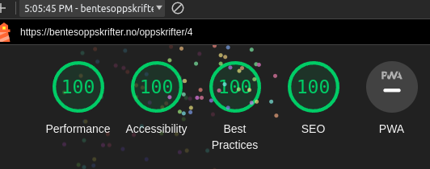
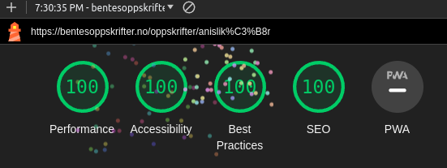
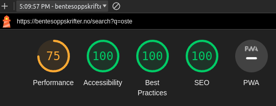
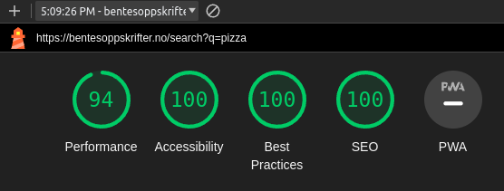

# Recipe Site

## TLDR

[FAFO](https://www.urbandictionary.com/define.php?term=FAFO) with [Astro](https://astro.build/). Translation: Wanted to try Astro.

## Long Version

This site is primarily an archive of recipes. The project aims to provide a sensible and fast way of handling large amounts of static content — as of right now, it includes 569 text documents and 614 images. The site is designed for those who may not be tech-savvy, old, or dyslexic, featuring large text, huge images, massive line spacing, and high contrast colors.

### Why Astro

Most pages serve static content, and Astro has emerged as one of the more popular static site generators (SSG). It offers nice features to manage collections such as type-safe front matter and provides tools for implementing pagination and image optimizations.

Astro also gives you the ability to opt-in and use larger JS frameworks such as React, Vue, Solid, Lit, and [more](https://docs.astro.build/en/guides/integrations-guide/#official-integrations). Deployment with SSR support is straightforward on platforms like CloudFlare, SST (AWS infra), and Vercel.

### Performance

#### Image Optimizations

Original images were saved as 3000x4000 jpg's (~3.5 MB), then converted to a more "reasonable" (1440x1920) resolution using a [bash script](https://github.com/Mordi490/recipe-site/blob/main/scripts/resize-images.sh), resulting in ~1 MB images. The images are processed with Astro's built-in `Image` component, which converts images to webp's and resizes them to multiple sizes. Resulting in a range of 50-300 KB. This was previously done with [depreciated custom code] (https://github.com/Mordi490/recipe-site/blob/30c592df5c06e784e3d3635aeecea601eccd8593/src/components/ResponsiveImage.astro), but now Astro's `Image` component does everything and more.

#### Lighthouse Scores

Every page scores a full 100 on Lighthouse, except for the search page. The search page may experience some layout shift if your query results in 50+ results and your connection is very slow.

This is somewhat expected since I used [FuseJS](https://www.fusejs.io/) for fuzzy search, useful for situations where you remember only a part of the name and typos. A more performant solution could be a static search library like [PageFind](https://pagefind.app/), which I discovered after implementing FuseJS. I might change just to see the differences in performance.

Examples of Lighthouse scores:

Worst-case scenario on the search page:

More reasonable case on the search page:

