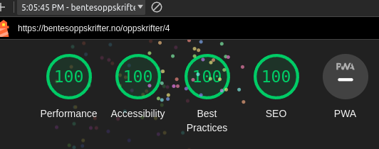
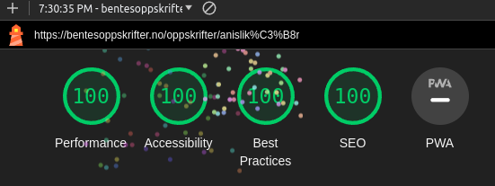
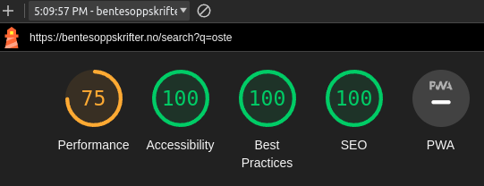
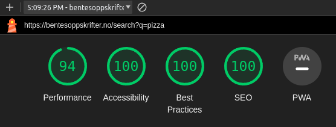

# Recipe Site

## TLDR

[FAFO](https://www.urbandictionary.com/define.php?term=FAFO) with [Astro](https://astro.build/). Translation: Wanted to try Astro

## Long Version

This is site is primarily a archive of recipes. The project aims to be a sensible and fast way of handling large amounts of static content, as of right now: 569 text documents and 614 images. The site is purposefully made for not tech-savvy, old & dyslexic people. This means large text, and high contrast colors galore.

### Why Astro

Most of the pages just serve static content, and Astro has emerged as one of the more popular static site generators (SSG). Astro also provides nice features to manage collections such as type-safe front matter, and provide features that make implementing pagination and image optimizations trivial.

Astro also gives a lot of headroom with the ability to opt-in and use larger JS frameworks such as react, vue, solid, lit and [more](https://docs.astro.build/en/guides/integrations-guide/#official-integrations). Astro is also trivial to deploy with SSR support on many of them, most notably CloudFlare, SST (AWS infra) & Vercel.

#### Performance

#### Image Optimizations

The original images were saved as 3000x4000 jpg's (~3.5 mb). These were then converted to a more "reasonable" resolution with a [bash script](https://github.com/Mordi490/recipe-site/blob/main/resize-images.sh). This script converts the images to 1440x1920(~1 mb). These images are then feed to a custom image component that takes the image, converts it to avif and resizes it to have widths of 400, 700 and 900 at build time. The end result is ~42-200 kb.

#### Lighthouse Scores

Every page scores full 100's on lighthouse, except for the search page. The search page occasionally prints out a single console.error, or takes too long to fetch and has some layout shift if your query results in 50+ results.

This is somewhat excepted since I used [FuseJS](https://www.fusejs.io/) to have fuzzy search which is useful for dyslexic people who often type things incorrectly. So a lenient search is very much by design and the performance hit is expected. A more performant solution a static search library like [PageFind](https://pagefind.app/), However I found about after implementaing FuseJS. Might change just to see the differences in performance.

Example of some Lighthouse scores

Worst case scenario on search page

More reasonable case on search page:

